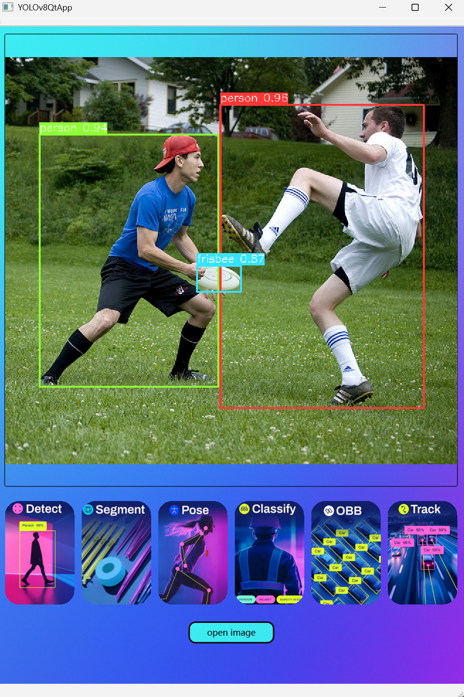
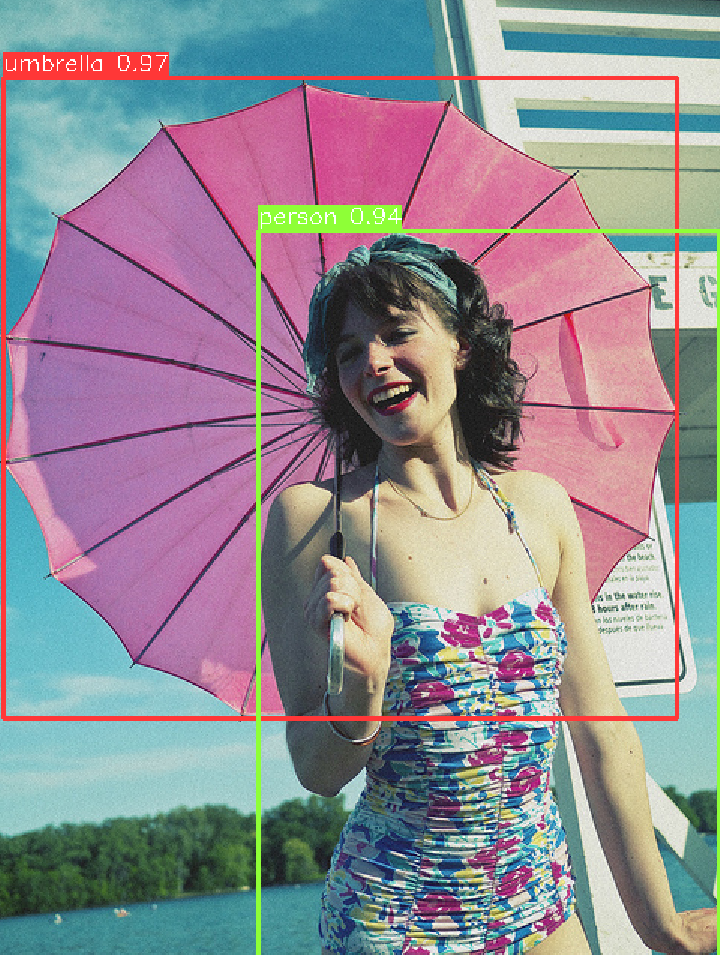
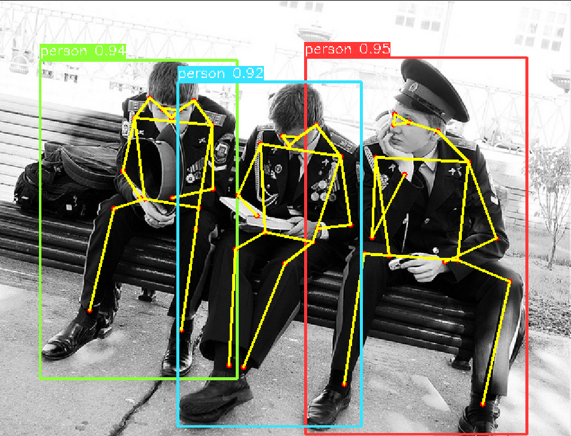
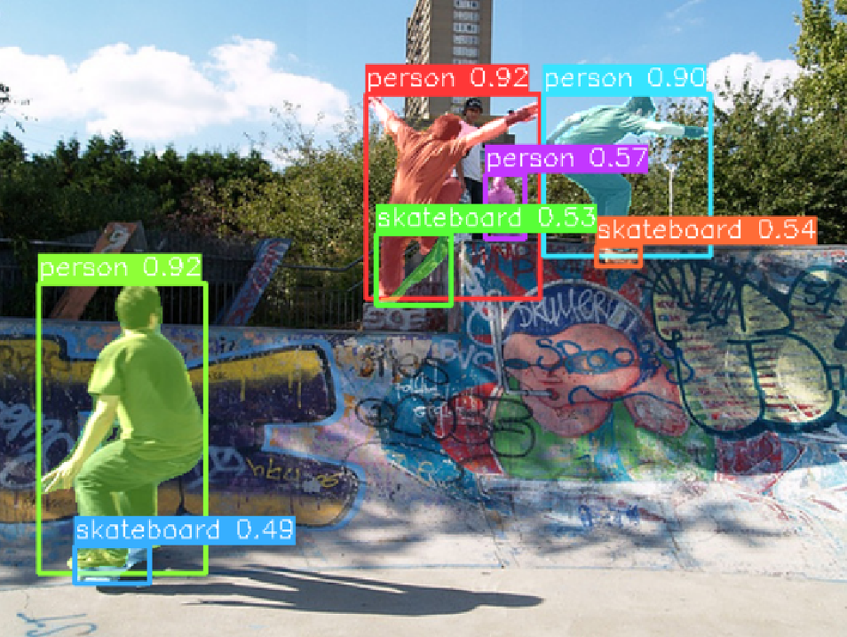

# YOLOv8QtApp

基于 Qt + C++ + OpenCV + ONNX Runtime 的 YOLOv8 多任务桌面推理 Demo，面向 Windows 桌面环境。当前工程已经打通单张图片的目标检测、实例分割、人体姿态估计和 OBB 旋转框推理流程，并提供可直接操作的 Qt 图形界面。

> 这个项目更适合用作学习、演示和二次开发起点，而不是开箱即用的通用部署框架。

## 项目预览

### UI 界面

<p align="center">
  
</p>

### 推理效果示例

以下图片来自 [`images/`](./images) 目录，用于展示当前项目已经跑通的典型任务效果。

<p align="center">
  
</p>

<p align="center">
  
</p>

<p align="center">
  
</p>

## 功能概览

- 基于 Qt Widgets 的桌面图形界面，支持打开图片并显示推理结果
- 支持 YOLOv8 `Detect / Segment / Pose / OBB`
- 支持结果可视化，包括检测框、分割掩码、关键点骨架和旋转框
- 推理后自动保存结果图像到当前工作目录下的 `outputs/`
- 后端会从 ONNX metadata 中读取 `imgsz / stride / names / task`，统一处理不同任务模型
- 内置基础性能日志输出，便于查看输入输出 shape 和推理耗时

## 当前支持情况

| 功能 | 状态 | 默认模型 | 说明 |
| --- | --- | --- | --- |
| Detect | 已支持 | `models/yolov8l.onnx` | 目标检测 |
| Segment | 已支持 | `models/yolov8l-seg.onnx` | 实例分割 |
| Pose | 已支持 | `models/yolov8l-pose.onnx` | 17 点人体姿态估计 |
| OBB | 已支持 | `models/yolov8n-obb.onnx` | 旋转框检测 |
| Classify | 已接通 | 复用 Detect 结果 | 当前不是独立分类模型，而是对检测结果做类别汇总 |
| Track | 未实现 | - | UI 按钮已预留，后续可接视频流或多目标跟踪 |

## 项目特点

### 1. Qt 图形界面直连推理流程

界面层逻辑很直接：打开图片，点击任务按钮，加载对应 ONNX 模型，完成推理后在界面显示并保存结果。对于学习 Qt 与模型部署结合、快速做本地 Demo 或课程作业展示，这种结构足够清晰。

### 2. 多任务共用统一后端

项目的核心不只是 UI，而是 `AutoBackendOnnx` 这层统一后端。它会读取模型 metadata，自动识别任务类型并分发到相应的后处理逻辑，因此同一套代码可以覆盖 detect、segment、pose、classify 和 obb。

### 3. 保留了调试与验证信息

程序会输出 ONNX 输入输出信息、类别名称和推理耗时，方便你确认模型是否被正确加载，以及不同任务的输出 shape 是否符合预期。

## 技术栈

- Qt Widgets
- C++17
- OpenCV 4.x
- ONNX Runtime
- YOLOv8 ONNX models
- Visual Studio 2022 toolchain

## 目录结构

```text
YOLOv8QtApp/
├── main.cpp                 # 程序入口
├── YOLOv8QtApp.*            # Qt 主窗口与交互逻辑
├── yolo_wrapper.*           # UI 层推理封装
├── onnx_model_base.*        # ONNX Runtime 会话封装
├── autobackend.*            # 多任务统一后端与后处理
├── augment.*                # 预处理与 mask 缩放
├── ops.*                    # NMS、坐标缩放等工具
├── common.*                 # 通用工具函数
├── constants.h              # 常量定义
├── resources.qrc            # Qt 资源文件
├── models/                  # ONNX 模型文件
├── images/                  # README 展示图与 UI 截图
├── build/                   # 本地构建产物
└── YOLOv8QtApp.pro          # qmake 工程文件
```

## 环境要求

推荐使用以下环境：

- Windows 10 / 11
- Qt 6.x
- Visual Studio 2022
- OpenCV 4.8.0 左右版本
- ONNX Runtime 1.15.1 左右版本
- C++17

> 说明：当前工程配置明显偏向 Windows + Qt Creator + MSVC。理论上可以迁移到其他环境，但仓库现状并不是跨平台即开即用。

## 构建与运行

### 1. 准备依赖

你需要先安装：

- Qt（建议使用带 MSVC2022 的桌面组件）
- OpenCV
- ONNX Runtime

### 2. 修改 `YOLOv8QtApp.pro` 中的依赖路径

当前 `.pro` 文件里写的是本机绝对路径，你需要改成自己机器上的路径，例如：

```pro
INCLUDEPATH += D:/deps/opencv/build/include
LIBS += -LD:/deps/opencv/build/x64/vc16/lib \
    -lopencv_world480

INCLUDEPATH += D:/deps/onnxruntime/include
LIBS += -LD:/deps/onnxruntime/lib \
    -lonnxruntime
```

### 3. 修改源码中的模型路径

当前模型路径同样是写死的绝对路径，位于 `YOLOv8QtApp.cpp`。如果你的项目目录不同，需要把这些路径改成你本机实际位置，或者改造成相对路径加载。

默认对应关系如下：

- `Detect` -> `models/yolov8l.onnx`
- `Segment` -> `models/yolov8l-seg.onnx`
- `Pose` -> `models/yolov8l-pose.onnx`
- `OBB` -> `models/yolov8n-obb.onnx`

### 4. 用 Qt Creator 打开工程

直接打开：

```text
YOLOv8QtApp.pro
```

选择合适的 Qt Kit，例如：

- Qt 6.9.0 MSVC2022 64bit

### 5. 编译并运行

建议先用 `Release` 进行构建和运行。

程序启动后：

1. 点击 `open image`
2. 选择一张图片
3. 点击对应任务按钮
4. 在界面中查看结果

推理结果会被保存到当前工作目录下的 `outputs/` 中。若你使用 Qt Creator 默认配置，通常会出现在 `build/.../outputs/`。

## 模型说明

`models/` 目录中已经放入了多组 ONNX 模型，包括：

- `yolov8l.onnx`
- `yolov8l-seg.onnx`
- `yolov8l-pose.onnx`
- `yolov8n.onnx`
- `yolov8n-seg.onnx`
- `yolov8n-pose.onnx`
- `yolov8n-obb.onnx`

项目当前更适合搭配由 Ultralytics 导出的、保留 metadata 的 ONNX 模型使用，因为后端依赖 metadata 来识别任务类型、输入尺寸和类别名称。

如果你要替换模型，建议优先确认以下几点：

- 模型的 `task` metadata 存在
- 模型的 `imgsz / stride / names` metadata 存在
- 输出 shape 与当前后处理逻辑兼容

## GPU / CUDA 说明

后端代码中已经保留了 CUDA provider 的分支逻辑，但当前 UI 封装默认是按 `cpu` 加载模型。

这意味着：

- 当前仓库默认运行方式是 CPU 推理
- 如果你想启用 GPU，需要自行切换 provider
- 同时还需要使用带 CUDA 的 ONNX Runtime 版本，并正确配置相关依赖

换句话说，仓库当前状态是“后端具备接入 CUDA 的代码基础”，但不是“打开项目就默认 GPU 加速”。

## 已知限制

- 依赖路径与模型路径目前是硬编码的，不适合直接跨机器使用
- `Classify` 目前是对检测结果做类别统计，不是独立分类头模型流程
- `Track` 还没有实现
- 工程当前主要面向单张图片，不支持视频流和摄像头实时推理
- 仓库内保留了 `build/` 和 `.pro.user` 这类本地开发产物，公开发布前通常建议清理

## 后续可扩展方向

- 改成相对路径或配置文件加载模型与依赖
- 增加视频、摄像头和跟踪功能
- 增加独立分类模型支持
- 增加 CPU / CUDA 切换开关
- 增加推理参数配置界面
- 导出 JSON 或文本格式结果

## 致谢

本项目使用或参考了以下生态：

- [Ultralytics YOLOv8](https://github.com/ultralytics/ultralytics)
- [ONNX Runtime](https://onnxruntime.ai/)
- [OpenCV](https://opencv.org/)
- [Qt](https://www.qt.io/)

## License

当前仓库中还没有附带正式的 `LICENSE` 文件。

如果你准备将它公开发布到 GitHub，建议在发布前补充明确的开源协议，例如 MIT、Apache-2.0 或 GPL，以避免后续使用边界不清晰。
